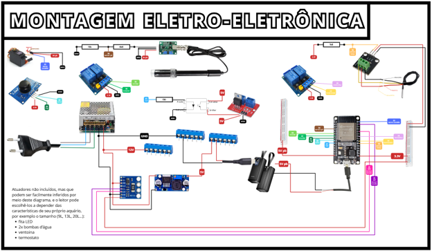

# GLUB_AQUARIUM

Sistema de automação e monitoramento de aquário desenvolvido para a disciplina **PCS3100 – Introdução à Engenharia de Computação**, da **Escola Politécnica da USP**.

> Projeto de automação residencial/aplicada voltado para controle de um aquário por meio de sensores, atuadores, ESP32, app móvel e comunicação via MQTT.

---

## Autores

- Gabriel Martins Cortez Veloso
- Gabriel Patente Tosi Joaquim
- Luís Eduardo Veloso Nunes Santos
- Rodrigo Franciso Pettinati Mikaro
- Thomaz Carleial de Andrade

---

## Sumário

- [Visão geral](#visão-geral)
- [Objetivos](#objetivos)
- [Arquitetura do sistema](#arquitetura-do-sistema)
- [Componentes utilizados](#componentes-utilizados)
- [Funcionalidades](#funcionalidades)
- [Instalação e execução](#instalação-e-execução)
- [Material adicional](#material-adicional)
- [Resultados e testes](#resultados-e-testes)
- [Custos do projeto](#custos-do-projeto)
- [Lições aprendidas](#lições-aprendidas)
- [Equipe](#equipe)

---

## Visão geral

O **GLUB_AQUARIUM** é um sistema de automação para aquário que integra:

- **Sensores** para monitoramento do ambiente;
- **Atuadores** para controle de iluminação, temperatura, circulação e alimentação;
- **ESP32** como unidade central de controle;
- **MQTT** para comunicação entre o sistema e o aplicativo;
- **App móvel** para interação com o usuário.

O objetivo do projeto é permitir o controle remoto e a automação das principais funções de um aquário, buscando praticidade, organização, segurança e melhor experiência de uso.

---

## Objetivos

O projeto foi desenvolvido com foco em:

- automatizar funções essenciais de um aquário;
- permitir controle remoto pelo usuário;
- centralizar a lógica em um ESP32;
- utilizar comunicação via MQTT;
- criar uma solução replicável e de baixo custo relativo;
- aplicar conceitos de engenharia de computação em um sistema real.

---

## Arquitetura do sistema

A arquitetura do sistema é composta por quatro camadas principais:

1. **Usuário**
2. **Aplicativo móvel**
3. **Broker MQTT**
4. **ESP32 e circuito eletroeletrônico**

O fluxo de funcionamento é o seguinte:

- o usuário configura preferências no app;
- o app publica esses dados no broker MQTT;
- o ESP32 assina os tópicos necessários e recebe os comandos;
- o ESP32 lê os sensores e controla os atuadores;
- o estado do sistema pode ser reenviado ao app para acompanhamento.

### siuu
<!-- inserir aqui a imagem do diagrama em blocos -->


### siuu
<!-- inserir aqui a imagem da arquitetura geral / MQTT -->


### Montagem eletro-eletrônica



---

## Componentes utilizados

### Controle e comunicação
- ESP32
- Broker MQTT
- Aplicativo móvel

### Sensores
- Sensor de temperatura
- Sensor de nível d’água
- Sensor de tensão/corrente
- Sensor de pH *(previsto no projeto; ver seção de lições aprendidas)*

### Atuadores
- Mini bombas de água
- Fita LED
- Termostato
- Ventoinha
- Servo motor para alimentação
- Servo motor para dosagem/ajuste de pH *(quando aplicável ao protótipo)*
- Módulos relé
- Módulo MOSFET

### Alimentação
- Fonte 110 V
- Fonte colmeia 12 V
- Regulador step-down 5 V
- Powerbank como alimentação auxiliar / de contingência

---

## Funcionalidades

O sistema contempla as seguintes funções principais:

- controle da luminosidade do aquário;
- troca parcial e periódica de água;
- medição e regulação de temperatura;
- alimentação regular dos peixes;
- notificação de falhas e erros do sistema;
- monitoramento remoto via app;
- armazenamento e uso de preferências do usuário;
- operação integrada entre sensores, atuadores e broker MQTT.

---

## Instalação e execução

> Esta seção deve permitir que outra pessoa consiga reproduzir o projeto.

### Pré-requisitos

- Arduino IDE ou ambiente compatível com ESP32;
- placa **ESP32**;
- acesso à internet;
- broker MQTT configurado;
- aplicativo móvel compatível com os tópicos do projeto;
- componentes eletrônicos descritos na montagem.

### Passo a passo

#### 1. Clonar o repositório
```bash
git clone [COLE_AQUI_O_LINK_DO_GITHUB]
