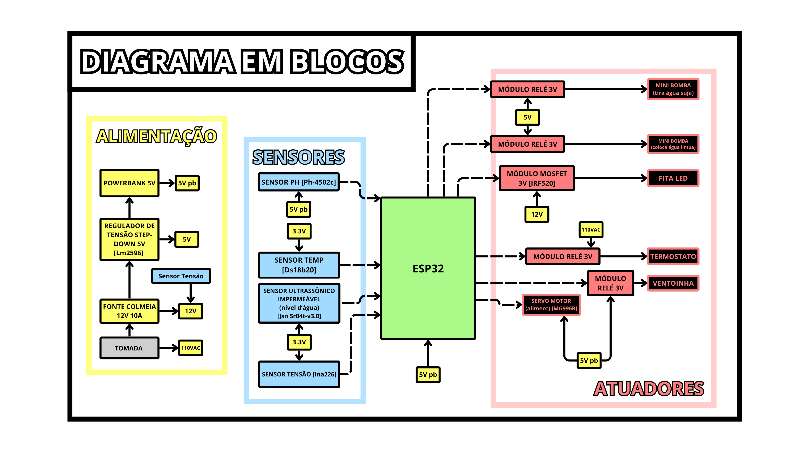
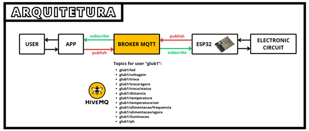

# GLUB_AQUARIUM

Sistema de automação e monitoramento de aquário desenvolvido para a disciplina **PCS3100 – Introdução à Engenharia de Computação**, da **Escola Politécnica da USP**.

> Projeto de automação residencial/aplicada voltado para controle de um aquário por meio de sensores, atuadores, ESP32, app móvel e comunicação via MQTT.

---

## Autores

- Gabriel Martins Cortez Veloso
- Gabriel Patente Tosi Joaquim
- Luís Eduardo Veloso Nunes Santos
- Rodrigo Franciso Pettinati Mikaro
- Thomaz Carleial de Andrade

---

## Sumário

- [Visão geral](#visão-geral)
- [Objetivos](#objetivos)
- [Arquitetura do sistema](#arquitetura-do-sistema)
- [Componentes utilizados](#componentes-utilizados)
- [Funcionalidades](#funcionalidades)
- [Instalação e execução](#instalação-e-execução)

---

## Visão geral

O **GLUB_AQUARIUM** é um sistema de automação para aquário que integra:

- **Sensores** para monitoramento do ambiente;
- **Atuadores** para controle de iluminação, temperatura, circulação e alimentação;
- **ESP32** como unidade central de controle;
- **MQTT** para comunicação entre o sistema e o aplicativo;
- **Web App** para interação e controle pelo usuário, acessível pelo navegador.

O objetivo do projeto é permitir o controle remoto e a automação das principais funções de um aquário, buscando praticidade, organização, segurança e melhor experiência de uso.

---

## Objetivos

O projeto foi desenvolvido com foco em:

- Automatizar funções essenciais de um aquário;
- Permitir controle remoto pelo usuário;
- Centralizar a lógica em um ESP32;
- Utilizar comunicação via MQTT;
- Criar uma solução replicável e de baixo custo relativo;
- Aplicar conceitos de engenharia de computação em um sistema real.

---

## Arquitetura do sistema

A arquitetura do sistema é composta por quatro camadas principais:

1. **Usuário**
2. **Web App**
3. **Broker MQTT**
4. **ESP32 e circuito eletroeletrônico**

O fluxo de funcionamento é o seguinte:

- O usuário configura preferências no app;
- O app publica esses dados no broker MQTT;
- O ESP32 assina os tópicos necessários e recebe os comandos;
- O ESP32 lê os sensores e controla os atuadores;
- O estado do sistema pode ser reenviado ao app para acompanhamento.

### Diagrama em Blocos



### Arquitetura



### Montagem eletro-eletrônica


---

## Componentes utilizados

### Controle e comunicação
- ESP32
- Broker MQTT (HiveMQ Cloud)
- Web App Responsivo (Flutter Web)

### Sensores
- Sensor de temperatura DS18B20
- Sensor ultrasônico JSN-SR04T (para medir nível de água)
- Sensor de tensão/corrente INA226
- Sensor de pH PH-4502C

### Atuadores
- Mini bombas de água
- Fita LED
- Termostato
- Ventoinha
- Servo motor MG996R para alimentação
- Servo motor para dosagem/ajuste de pH *(quando aplicável ao protótipo)*
- Módulos relé
- Módulo MOSFET IRF520

### Alimentação
- Fonte 110 V
- Fonte colmeia 12 V
- Regulador step-down LM2596 5 V
- Powerbank como alimentação auxiliar / de contingência

---

## Funcionalidades

O sistema contempla as seguintes funções principais:

- Controle da luminosidade do aquário;
- Troca parcial e periódica de água;
- Medição e regulação de temperatura;
- Alimentação regular dos peixes;
- Notificação de falhas e erros do sistema;
- Monitoramento remoto via app;
- Armazenamento e uso de preferências do usuário;
- Operação integrada entre sensores, atuadores e broker MQTT.

---

## Instalação e execução

Siga os passos abaixo para configurar o ambiente de desenvolvimento, carregar o código no hardware e acessar a interface de controle do sistema.

### 1. Broker MQTT (HiveMQ Cloud)

O sistema utiliza o [HiveMQ Cloud](https://www.hivemq.com/mqtt-cloud-broker/) como broker MQTT. A camada gratuita é suficiente para o projeto.

#### Passo a Passo

1. Crie uma conta em [hivemq.com](https://www.hivemq.com/mqtt-cloud-broker/) e acesse o painel.
2. Crie um novo cluster gratuito (Serverless ou Free Tier).
3. Na aba **Access Management**, crie um usuário com senha e anote as credenciais.
4. Na visão geral do cluster, copie o **Host** no formato:
   ```
   xxxxxxxxxxxxxxxxxxxxxxxxxxxxxxxx.s1.eu.hivemq.cloud
   ```
5. Anote as seguintes informações para uso nas etapas seguintes:

| Parâmetro       | Valor                                        |
|-----------------|----------------------------------------------|
| Host            | `<seu-cluster>.s1.eu.hivemq.cloud`           |
| Porta MQTT/TLS  | `8883` (ESP32)                               |
| Porta WSS       | `8884` (Web App)                             |
| Usuário         | `<usuário criado>`                           |
| Senha           | `<senha criada>`                             |

#### Tópicos utilizados

| Tópico                        | Direção         | Descrição                        |
|-------------------------------|-----------------|----------------------------------|
| `glub1/temperatura`           | ESP32 → App     | Leitura de temperatura           |
| `glub1/voltagem`              | ESP32 → App     | Leitura de tensão/corrente       |
| `glub1/ph`                    | ESP32 → App     | Leitura de pH                    |
| `glub1/iluminacao`            | App → ESP32     | Controle da fita LED             |
| `glub1/alimentacao/frequencia`| App → ESP32     | Frequência de alimentação        |
| `glub1/alimentacao/agora`     | App → ESP32     | Alimentação imediata             |
| `glub1/troca`                 | App → ESP32     | Agendamento de troca de água     |
| `glub1/troca/agora`           | App → ESP32     | Troca de água imediata           |

> ⚠️ **Aviso de Segurança da Informação**
> 
> Para fins estritamente didáticos e para facilitar a avaliação, as credenciais de acesso ao Broker MQTT do HiveMQ foram mantidas temporariamente explícitas nos códigos deste repositório público.
> 
> Em um sistema comercial ou de produção real, as credenciais **nunca** seriam expostas no repositório. 

---

### 2. Firmware (ESP32)

#### Pré-requisitos

- Arduino IDE com suporte às placas ESP32 configurado.
- Cabo USB para transferência de dados.
- Biblioteca PubSubClient instalada na IDE para gerenciamento do protocolo MQTT.

#### Passo a Passo

1. Clone este repositório em sua máquina local:
   ```bash
   git clone https://github.com/RodrigoMikaro/GLUB_AQUARIUM.git
   ```
2. Abra o arquivo principal de código na Arduino IDE.
3. Insira as credenciais da sua rede local Wi-Fi e os dados do broker HiveMQ nas variáveis correspondentes de configuração do sistema (host, porta `8883`, usuário e senha criados na etapa anterior).
4. Conecte a placa ESP32 ao computador, selecione a porta correta e realize o upload do código.
5. Abra o Serial Monitor para acompanhar o status da inicialização e verificar o sucesso da conexão com a rede e com o broker.

---

### 3. Interface (Web App)

A interface de usuário foi desenvolvida como uma aplicação web responsiva em Flutter.

O painel está publicado e disponível para uso imediato pelo link:

[Acessar GLUB_AQUARIUM Web APP](https://merry-kulfi-37783b.netlify.app/)

---

### Repositório GitHub

https://github.com/RodrigoMikaro/GLUB_AQUARIUM

### Pitch inicial

https://youtu.be/c4ZVzafg15c

### Pitch final

[Adicionar link do pitch final]
